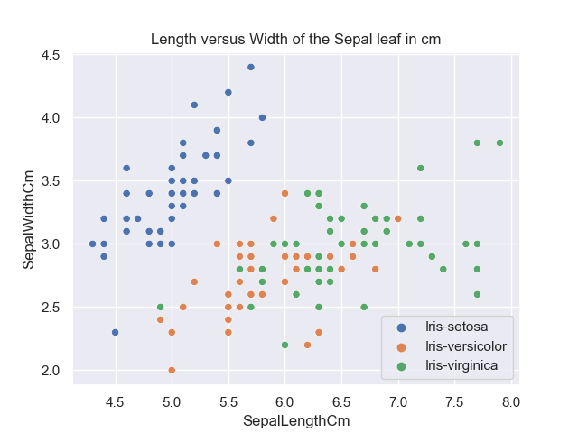

# Final project for the course Programming and Scripting 2021

This repository include the Final Project 2021 for the Module Programming and Scripting. 

This project contains the research of the ***Fisher's Iris data set*** which will be investigated in Python and a summary will be provided in this readme file. 
It will include background information about the data set used and will explain what investigating a data set entails and how Python can be used to do this. 

## Table of contents
* [Background](#Background)
    * [Fishers Iris data set](#Summary-of-the-Fisher's-Iris-data-set)
    * [Python Analytics tool](#Python-Analytics-tool)
        * [Libraries](#Libraries)
        * [Requirements](#Requirements-to-run-Python-code)
* [Implementation and Code explanation](#Implementation-and-Code-explanation)
    * [Dataset import](#dataset-import)
    * [Summary of variables](#Summary-of-variables)
    * [Plots](#Plots)
        * [Histograms](#Histograms-of-Variables )
        * [Scatterplots](#Scatterplots-of-pair-of-Variables)
        * [Pairplot](#Pairplot)
* [Results presentation](#Results-presentation)
    * [Analysis of the Fishers Iris Data set](#Investigation-of-the-Fishers-Iris-Data-set)
    * [Pythons role](#Pythons-role)
* [Project conclusion](#Conclusion) 
* [References](#References)
* [Entries and updates](#Entries-and-Updates)


## Background

### Summary of the Fisher's Iris data set

The *iris* is a genus of plants with around 260-300 different species with either yellow, blue or multi-colored petals, which is why this plant was named after the Greek goddess of the rainbow (iris). [1] 

 

**Figure 1: Petals & Sepals for Iris setosa, Iris versicolor, and Iris virginica [1]**

Why this plant is described here is as follows:

Sir Ronald Aylmer Fisher was a British statistician and geneticist who published *“The Use of Multiple Measurements in Taxonomic Problems”* in the journal *“Annals of Eugenics”* in 1936. In his work, Fisher developed and evaluated a linear function for distinguishing iris species based on the morphology of their flowers, using the *Fisher’s Iris dataset*. This dataset is also called *Anderson’s Iris dataset* because Edgar Anderson’s collected the data mainly in Canada to quantify the morphological variation of iris flowers of three related species. [2,3]

The dataset contains values of 50 flowers of the three flower species *“Iris setosa”*, *“Iris versicolor”* and *“Iris virginica”*. For each flower, the following information was collected:
   - the length of the sepal leaf in cm ("sepalLength");
   - the width of the sepal leaf in cm (“sepalWidth”);
   - the length of the petal in cm (“petalLength”);
   - the width of the petal in cm (“petalwidth”); 
   - the species of flower ("class"). [2]

 [2]

**Figure 2: Morphological Measures of Iris Flowers [1]**

### Python Analytics tool 


#### Libraries 

The following libraries were used in this project:    

```python
   import pandas as pd 
   import numpy as np
   import matplotlib.pyplot as plt 
   import seaborn as sns 
```

***pandas*** stands for "Python Data Analysis" and was created as an open source by Wes McKinney.
This project uses the library to take data directly from the csv file uploaded. This library creates a Python object with rows and columnes called dataframe (oftne refer to in code as df) which allows to work with a "table like" structure rather having to work with lists and/or directories using for loops/list comprehension. A "nickname"/ short for pandas has been created for better usability to access Pandas with "pd.command" instead of having to use "pandas.command". Numpy is usually used in combination with pandas. 
[4]

***numPy*** stands for "Numberical Python" and is the library that pandas, matplotlib and Scikit-learn are build on. It is not as default installed an therefore has to be added. This has been done at the start of this module via Anaconda. 
[5]

***matplotlib***

***seaborn***

#### Requirements to run Python code


## Implementation and Code explanation

### Dataset import

### Summary of Variables

### Plots

#### Histograms of Variables 

1. Length of the sepal leaf in cm ("SepalLengthCm")

 

2. Width of sepal leaf in cm ("SepalWidthCm")

 

3. Length of petal leaf in cm ("PetalWidthCm") 

 

4. Width of petal leaf in cm ("PetalLengthCm")

 

5. Summary of all variables for Sepal Lenght/Width & Petal Length/Width, 

 

```python
    f,a = plt.subplots(2,2)
    a = a.ravel()
    for idx,ax in enumerate(a):
        ax.hist(new_iris.iloc[:,idx], bins='auto', color='#0504aa',alpha=0.7, rwidth=0.85) 
        ax.set_title(new_iris.columns[idx])
        ax.set_ylabel('Count')
        ax.set_xlabel(new_iris.columns[idx])
    plt.tight_layout()
``` 

#### Scatterplots of pair of Variables 

A scatterplot is used to analyse relationships between variables. The dots in the graph are presenting 

#### Pairplot

## Results presentation

### Investigation of the Fisher's Iris Data set

#### Analysis of the Scatterplots

1.  



**Figure 8: Scatterplot of the iris data set for sepal length vs sepal width (left) and for petal length vs petal width (right)**

### Pythons role

## Conclusion

## References

### References Summary of Fisher's Iris data set: 
[1] https://en.wikipedia.org/wiki/Iris_(plant) 
[2] https://towardsdatascience.com/the-iris-dataset-a-little-bit-of-history-and-biology-fb4812f5a7b5 
[3] https://en.wikipedia.org/wiki/Iris_flower_data_set

### References Analysis of the Fisher's Iris Dataset
[4](https://towardsdatascience.com/a-quick-introduction-to-the-pandas-python-library-f1b678f34673)
[5](https://towardsdatascience.com/a-quick-introduction-to-the-numpy-library-6f61b7dee4db)

### PNG references 
[1] Iris flower: https://towardsdatascience.com/the-iris-dataset-a-little-bit-of-history-and-biology-fb4812f5a7b5 
[2] https://towardsdatascience.com/the-iris-dataset-a-little-bit-of-history-and-biology-fb4812f5a7b5 


### References and Source: 
Dataset: https://archive.ics.uci.edu/ml/datasets/Iris

### GitHub formatting 
[PNG added to readme] (https://www.youtube.com/watch?v=hHbWF1Bvgf4)
[Basic writing and formatting syntax in GitHub] https://docs.github.com/en/github/writing-on-github/basic-writing-and-formatting-syntax
[Fenced code block added to readme] (https://docs.github.com/en/github/writing-on-github/creating-and-highlighting-code-blocks)

### Other repositiories
[GitHub repository] (https://github.com/sandraelekes/pands-project-2020/blob/master/README.md)

## Entries and Updates 

11MAR21: Creation of git hub repository 
23MAR21: 
  - Uploaded dataset. Download dataset from https://archive.ics.uci.edu/ml/datasets/Iris.
      changed iris.data to iris.csv. Added Column titles to 
        1. sepal length (in cm)
        2. sepal width (in cm)
        3. petal length (in cm)
        4. petal width (in cm)
        5. class
      as per iris.names file section 7 Attributes. 
  - Started summary of the Fisher's Iris Dataset
27MAR21 - 11APR21: 
  - Easter break
19APR21: 
  - updated dataset from https://www.geeksforgeeks.org/box-plot-and-histogram-exploration-on-iris-data/ due to issues of unnamed columns. 
22APR21: 
  - created histograms of all variable using code in analysis.py and updated readme file
  - added Table of Content to the readme file (sorce https://github.com/sandraelekes/pands-project-2020/blob/master/README.md)
23APR21:
  - updated Readme file 
       - Table of Content as per structure of the readme file
  - 