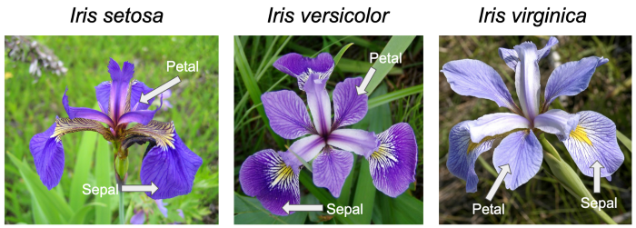

# Final project for the course Programming and Scripting 2021

## Summary of the Fisher's Iris data set

The *iris* is a genus of plants with around 260-300 different species with either yellow, blue or multi-colored petals, which is why this plant was named after the Greek goddess of the rainbow (iris). [1] 

 

**Figure 1: Petals & Sepals for Iris setosa, Iris versicolor, and Iris virginica [1]**

Why this plant is described here is as follows:

Sir Ronald Aylmer Fisher was a British statistician and geneticist who published *“The Use of Multiple Measurements in Taxonomic Problems”* in the journal *“Annals of Eugenics”* in 1936. In his work, Fisher developed and evaluated a linear function for distinguishing iris species based on the morphology of their flowers, using the *Fisher’s Iris dataset*. This dataset is also called *Anderson’s Iris dataset* because Edgar Anderson’s collected the data mainly in Canada to quantify the morphological variation of iris flowers of three related species. [2,3]

The dataset contains values of 50 flowers of the three flower species *“Iris setosa”*, *“Iris versicolor”* and *“Iris virginica”*. For each flower, the following information was collected:
   - the length of the sepal leaf in cm ("sepalLength");
   - the width of the sepal leaf in cm (“sepalWidth”);
   - the length of the petal in cm (“petalLength”);
   - the width of the petal in cm (“petalwidth”); 
   - the species of flower ("class"). [2]

 [2]

**Figure 2: Morphological Measures of Iris Flowers [1]**

## Analysis of the Fisher's Iris Data set

## Interpretation of results

## Conclusion

## References Summary of Fisher's Iris data set: 
[1] https://en.wikipedia.org/wiki/Iris_(plant) 
[2] https://towardsdatascience.com/the-iris-dataset-a-little-bit-of-history-and-biology-fb4812f5a7b5 
[3] https://en.wikipedia.org/wiki/Iris_flower_data_set

## References Analysis of the Fisher's Iris Dataset

## PNG references: 
[1] Iris flower: https://towardsdatascience.com/the-iris-dataset-a-little-bit-of-history-and-biology-fb4812f5a7b5 
[2] https://towardsdatascience.com/the-iris-dataset-a-little-bit-of-history-and-biology-fb4812f5a7b5 

## References & Source: 
Dataset: https://archive.ics.uci.edu/ml/datasets/Iris

## Tutorials used: 
PNG added to readme: https://www.youtube.com/watch?v=hHbWF1Bvgf4
Basic writing and formatting syntax in GitHub: https://docs.github.com/en/github/writing-on-github/basic-writing-and-formatting-syntax

## Entries & Updates: 

11MAR21: Creation of git hub repository 
23MAR21: 
    - Uploaded dataset. Download dataset from https://archive.ics.uci.edu/ml/datasets/Iris.
      changed iris.data to iris.csv. Added Column titles to 
        1. sepal length (in cm)
        2. sepal width (in cm)
        3. petal length (in cm)
        4. petal width (in cm)
        5. class
      as per iris.names file section 7 Attributes. 
    - Started summary of the Fisher's Iris Dataset