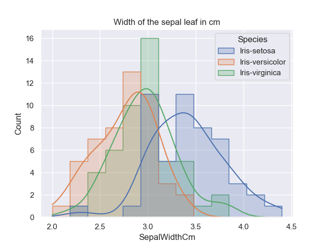

# Final project for the course Programming and Scripting 2021
<div align="justify">
This repository include the Final Project 2021 for the Module Programming and Scripting. 

This project contains the research of the ***Fisher's Iris data set*** which will be investigated in Python and a summary will be provided in this readme file. 
It will include background information about the data set used and will explain what investigating a data set entails and how Python can be used to do this. 
</div>

## Table of contents
* [Background](#Background)
    * [Fishers Iris data set](#Summary-of-the-Fisher's-Iris-data-set)
    * [Python Analytics tool](#Python-Analytics-tool)
        * [Libraries](#Libraries)
        * [Requirements](#Requirements-to-run-Python-code)
* [Implementation and Code explanation](#Implementation-and-Code-explanation)
    * [Dataset import](#dataset-import)
    * [Summary of variables](#Summary-of-variables)
    * [Data Visualisation](#Data-Visualisation)
        * [Histograms](#Histograms-of-Variables )
        * [Scatterplots](#Scatterplots-of-pair-of-Variables)
        * [Pairplot](#Pairplot)
* [Data Analysis](#Data-analysis)
    * [Analysis of the Fishers Iris Data set](#Analysis-of-the-Fishers-Iris-Data-set)
    * [Pythons role](#Pythons-role)
* [Project conclusion](#Conclusion) 
* [References](#References)
* [Entries and updates](#Entries-and-Updates)


## Background

<div align="justify">
The background section is an introduction to this Project. It will give some background information about the data set used to analyse and interpret using Python as data anlysis tool. 
It will give a brief description about libraries that were used throughout the code implementation and what is required to run this code. 
</div>

### Summary of the Fisher's Iris data set

The *iris* is a genus of plants with around 260-300 different species with either yellow, blue or multi-colored petals, which is why this plant was named after the Greek goddess of the rainbow (iris). [1] 

<p align="center">

</p>

**Figure 1: Petals & Sepals for Iris setosa, Iris versicolor, and Iris virginica [1]**


Why this flower is described here is as follows:

<div align="justify">
Sir Ronald Aylmer Fisher was a British statistician and geneticist who published *“The Use of Multiple Measurements in Taxonomic Problems”* in the journal *“Annals of Eugenics”* in 1936. In his work, Fisher developed and evaluated a linear function for distinguishing iris species based on the morphology of their flowers, using the *Fisher’s Iris dataset*. This dataset is also called *Anderson’s Iris dataset* because Edgar Anderson’s collected the data mainly in Canada to quantify the morphological variation of iris flowers of three related species. [2,3]
</div>

The dataset contains values of 50 flowers of the three flower species *“Iris setosa”*, *“Iris versicolor”* and *“Iris virginica”*. For each flower, the following information was collected:
   - the length of the sepal leaf in cm ("sepalLength");
   - the width of the sepal leaf in cm (“sepalWidth”);
   - the length of the petal in cm (“petalLength”);
   - the width of the petal in cm (“petalwidth”); 
   - the species of flower ("class"). [2]

<p align="center">

</p>

**Figure 2: Morphological Measures of Iris Flowers [2]**

### Python Analytics tool 

Python is a programming language created for scientific computing tasks, which includes the analysis and visualisation of datasets. Originally the programming language was not designed for this tasks but due to the large active ecosystem of third party packages such as NumPy, Pandas

#### Libraries 

The following libraries were imported in this project:    

```python
   import pandas as pd 
  # import numpy as np
   import matplotlib.pyplot as plt 
   import seaborn as sns 
```
<div align="justify">

***pandas*** stands for "Python Data Analysis" and was created as an open source by Wes McKinney.
This project uses the library to take data directly from the csv file uploaded. This library creates a Python object with rows and columnes called dataframe (oftne refer to in code as df) which allows to work with a "table like" structure rather having to work with lists and/or directories using for loops/list comprehension. A "nickname"/ short for pandas has been created for better usability to access Pandas with "pd.command" instead of having to use "pandas.command". Numpy is usually used in combination with pandas. 
[4]
</div>

<div align="justify">

***numPy*** stands for "Numberical Python" and is the library that pandas, matplotlib and Scikit-learn are build on. It is not as default installed an therefore has to be added. This has been done at the start of this module via Anaconda. It is used for the manipulation of Python objects also called multi-dimensional array-based data and is the main package for scientific computing with Python. The arrays include collected values. 
[5]
</div>

<div align="justify">

***matplotlib*** is a library used to mimic the functions of MATLAB, which is a programming and numeric computing platform to analyse data, develop algorithms and to create models for example with the build in package Simulink. Each pyplot function does a change to a figure, for example it creates a figure, decorates plots with labels and titles and saves the figure (all examples used in this project).

</div>

***seaborn***

#### Requirements to run Python code


## Implementation and Code explanation

### Dataset import

<div align="justify">
Once the data has been downloaded and reviewed for accurracy (rows 150 (data entries), columns 6 (Id, 4 variables, Species)) it was uploaded to the repository in the subrepository data as csv file called iris.csv. The library panda allows to read the file in csv format. For usability the data set was assigned to a variable called <i>iris</i>, which is used in any further code. See below code extract used in analysis.py. 
</div>

```python
    iris = pd.read_csv('data/iris.csv') 
```

### Summary of Variables

### Data Visualisation 

#### Histograms of Variables 


1. Length of the sepal leaf in cm ("SepalLengthCm")

<p align="center">

</p>

2. Width of sepal leaf in cm ("SepalWidthCm")

<p align="center">

</p>

3. Length of petal leaf in cm ("PetalWidthCm") 
<p align="center">

</p>

4. Width of petal leaf in cm ("PetalLengthCm")

<p align="center">

</p>

Code extract for plots 1 - 4 

```python
    sns.displot(iris, x="SepalLengthCm", hue="Species", element="step") 
```

**Summary of all variables for Sepal Lenght/Width & Petal Length/Width**

<ins>Histograms in Matplotlib:</ins> Wikipedia describs Histograms as an accurate graphical representation of the distribution of numerical data. The histogram was first introduced by Karl Pearson. Basically it consists of multiple bar graph added into one graph. To construct a histogram, it is required to define so called <i>bins</i> which is defined by the range of values devided by the entire range of values into a series of intervals. 

<p align="center">

</p>

```python
    f,a = plt.subplots(2,2)
    a = a.ravel()
    for idx,ax in enumerate(a):
        ax.hist(new_iris.iloc[:,idx], bins='auto', color='#0504aa',alpha=0.7, rwidth=0.85) 
        ax.set_title(new_iris.columns[idx])
        ax.set_ylabel('Count')
        ax.set_xlabel(new_iris.columns[idx])
    plt.tight_layout()
``` 

#### Scatterplots of pair of Variables 

A scatterplot is used to analyse relationships between variables. The dots in the graph are presenting 

#### Pairplot

## Data Analysis

### Analysis of the Fisher's Iris Data set

#### Analysis of the Scatterplots


**Figure 8: Scatterplot of the iris data set for sepal length vs width (left) and for petal length vs width (right)**

<div align="justify">
The scatterplot above show the relationship between length vs width for each the sepal leaf and the petal leaf for the three different species Iris Setosa, Iris versicolar and Iris virginica. All quantities are measured in the unit centimeters(cm). In both graphs it is clearly visible that Iris setosa (blue dots) is well distinguishable from the other two species. This is not the case for Iris versicolar and Iris virginica when only reviewing the sepal leaf scatterplot on the left. However if the petal leaf scatterplot on the right is taken into account even though some data entries overlap it is still clearly visible that Iris virginica tents to larger values than Iris versicolor for the petal length and width. 

Noticeable is that the left graphs seems to show less data entries for Iris setosa compared to the right graph. Knowing that their are 50 entries for each variable per Species the scatterplot only shows around 20 data entries on the plot. This is as some values are the exact same and therefore would be plotted at the same position. 
</div>

### Pythons role

Advantages of python versus other data analysis programs/tools such as Matlab, SPSS, Minitab, 

## Conclusion


## References

### References Summary of Fisher's Iris data set: 
[1] https://en.wikipedia.org/wiki/Iris_(plant) 
[2] https://towardsdatascience.com/the-iris-dataset-a-little-bit-of-history-and-biology-fb4812f5a7b5 
[3] https://en.wikipedia.org/wiki/Iris_flower_data_set

### References Analysis of the Fisher's Iris Dataset
[4](https://towardsdatascience.com/a-quick-introduction-to-the-pandas-python-library-f1b678f34673)
[5](https://towardsdatascience.com/a-quick-introduction-to-the-numpy-library-6f61b7dee4db)

### PNG references 
[1] Iris flower: https://towardsdatascience.com/the-iris-dataset-a-little-bit-of-history-and-biology-fb4812f5a7b5 
[2] https://towardsdatascience.com/the-iris-dataset-a-little-bit-of-history-and-biology-fb4812f5a7b5 


### References and Source: 
[Dataset](https://archive.ics.uci.edu/ml/datasets/Iris)
[NumPy](https://towardsdatascience.com/a-quick-introduction-to-the-numpy-library-6f61b7dee4db)
(https://www.google.com/imgres?imgurl=https%3A%2F%2Fi.stack.imgur.com%2FNWTQH.png&imgrefurl=https%3A%2F%2Fstackoverflow.com%2Fquestions%2F66434570%2Fnumpys-shape-function-returns-a-1d-value-for-a-2d-array&tbnid=3mLgD0we3AuveM&vet=12ahUKEwiA7qXdr5vwAhVVVhUIHUNfABEQMygBegUIARC3AQ..i&docid=ZjuYBSiXmg5NpM&w=1440&h=805&q=multi-dimensional%20arrays%20in%20numpy&ved=2ahUKEwiA7qXdr5vwAhVVVhUIHUNfABEQMygBegUIARC3AQ) (not used currently)
[Matplotlib](https://matplotlib.org/stable/tutorials/introductory/pyplot.html#:~:text=matplotlib.,the%20plot%20with%20labels%2C%20etc.)
[Hue](https://en.wikipedia.org/wiki/Hue)

Books references: 
Data analysis of Scatterplots: https://books.google.ie/books?id=EvGCsYeOFNwC&pg=PA46&dq=correct+analysis+iris+dataset+scatter+plot&hl=en&sa=X&ved=2ahUKEwjOyZ-ZrZTwAhWaRhUIHQ4_BFEQ6AEwAXoECAMQAg#v=onepage&q=correct%20analysis%20iris%20dataset%20scatter%20plot&f=false  
Guide to Intelligent Data Analysis: How to Intelligently Make Sense of Real Data, 
By Michael R. Berthold, Christian Borgelt, Frank Höppner, Frank Klawonn, Springer Verlag Page 45 to 47 

### GitHub formatting 
[PNG added to readme](https://www.youtube.com/watch?v=hHbWF1Bvgf4)
[Basic writing and formatting syntax in GitHub](https://docs.github.com/en/github/writing-on-github/basic-writing-and-formatting-syntax)
[Fenced code block added to readme](https://docs.github.com/en/github/writing-on-github/creating-and-highlighting-code-blocks)
[Position of pngs in readme](https://github.com/DavidWells/advanced-markdown/blob/master/README.md)

### Other repositiories
[GitHub repository](https://github.com/sandraelekes/pands-project-2020/blob/master/README.md)

## Entries and Updates 

<details>
<summary>"Click to expand"</summary>

11MAR21: 
  - Creation of git hub repository 

23MAR21: 
  - Uploaded dataset. Download dataset from https://archive.ics.uci.edu/ml/datasets/Iris.
      changed iris.data to iris.csv. Added Column titles to 
        1. sepal length (in cm)
        2. sepal width (in cm)
        3. petal length (in cm)
        4. petal width (in cm)
        5. class
      as per iris.names file section 7 Attributes. 
  - Started summary of the Fisher's Iris Dataset

27MAR21 - 11APR21: 
  - Easter break

19APR21: 
  - updated dataset from https://www.geeksforgeeks.org/box-plot-and-histogram-exploration-on-iris-data/ due to issues of unnamed columns. 

22APR21: 
  - created histograms of all variable using code in analysis.py and updated readme file
  - added Table of Content to the readme file (sorce https://github.com/sandraelekes/pands-project-2020/blob/master/README.md)

23APR21:
  - updated Readme file 
       - Table of Content as per structure of the readme file
  - Scatterplot created for Iris Petal Width vs Length & for Iris Sepal Width vs Length 
  - Wrote text to add to Analysis of the scatterplots (https://books.google.ie/books?id=EvGCsYeOFNwC&pg=PA46&dq=correct+analysis+iris+dataset+scatter+plot&hl=en&sa=X&ved=2ahUKEwjOyZ-ZrZTwAhWaRhUIHQ4_BFEQ6AEwAXoECAMQAg#v=onepage&q=correct%20analysis%20iris%20dataset%20scatter%20plot&f=false)
  - Research jitter

24APR21:
  - Formatting of readme (picture position center, text alignment justify)(https://github.com/DavidWells/advanced-markdown/blob/master/README.md#why-markdown)
  - Added collaps section for Entries and Updates (https://github.com/DavidWells/advanced-markdown/blob/master/README.md#why-markdown)

</details>