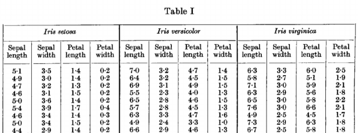
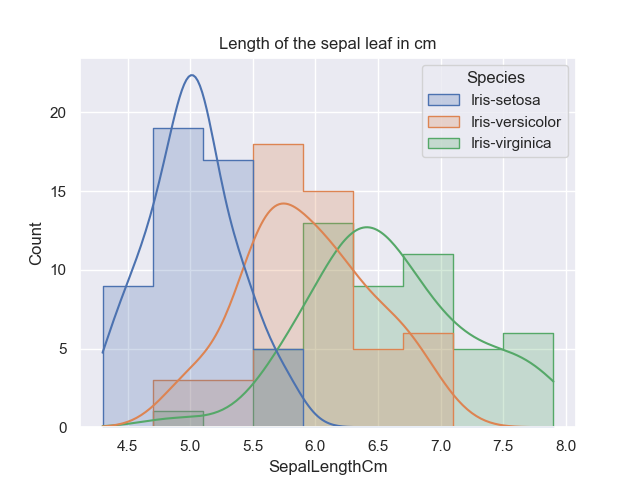
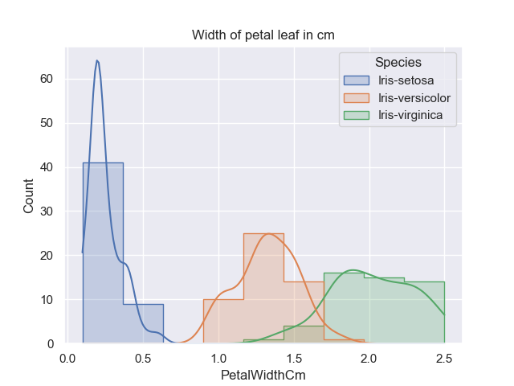

# Final project for the course Programming and Scripting 2021
<div align="justify">
This repository include the Final Project 2021 for the Module Programming and Scripting. 

This project contains the research of the ***Fisher's Iris data set*** which will be investigated in Python and a summary will be provided in this readme file. 
It will include background information about the data set used and will explain what investigating a data set entails and how Python can be used to do this. 
</div>

## Table of contents
- [Final project for the course Programming and Scripting 2021](#final-project-for-the-course-programming-and-scripting-2021)
  - [Table of contents](#table-of-contents)
  - [Background](#background)
    - [Summary of the Fisher's Iris data set](#summary-of-the-fishers-iris-data-set)
    - [Python as Data Analytics tool](#python-as-data-analytics-tool)
      - [Libraries](#libraries)
      - [Requirements to run Python code](#requirements-to-run-python-code)
  - [Implementation and Code explanation](#implementation-and-code-explanation)
    - [Dataset import](#dataset-import)
    - [Summary of Variables](#summary-of-variables)
    - [Data Visualisation](#data-visualisation)
      - [Histograms of Variables](#histograms-of-variables)
      - [Scatterplots of pair of Variables](#scatterplots-of-pair-of-variables)
      - [Pairplot](#pairplot)
  - [Data Analysis](#data-analysis)
    - [Analysis of the Fisher's Iris Data set using plot figures](#analysis-of-the-fishers-iris-data-set-using-plot-figures)
      - [Analysis of the Histograms](#analysis-of-the-histograms)
      - [Analysis of the Scatterplots](#analysis-of-the-scatterplots)
    - [Pythons role](#pythons-role)
  - [Conclusion](#conclusion)
  - [References](#references)
    - [References Summary of Fisher's Iris data set:](#references-summary-of-fishers-iris-data-set)
    - [References Python Analytic Tool](#references-python-analytic-tool)
    - [References Analysis of the Fisher's Iris Dataset](#references-analysis-of-the-fishers-iris-dataset)
    - [PNG references](#png-references)
    - [GitHub formatting](#github-formatting)
    - [Other repositiories](#other-repositiories)
  - [Entries and Updates](#entries-and-updates)


## Background
<div align="justify">
The <b>Background</b> section is an introduction to this Project. It will give some background information about the data set used which then was visualised with Python as data anlysis tool and third party packages. 
This section will therefore also give a brief description of the libraries that were used throughout the code implementation and what are the requirements to run the code programmed in <i>analysis.py</i>. 
</div>

### Summary of the Fisher's Iris data set
<div align="justify">
The <i>iris</i> is a genus of plants with around 260-300 different species with either yellow, blue or multi-colored petals, which is why this plant was named after the Greek goddess of the rainbow (iris). [1] 

</div>
<p align="center">

</p>
<div align="center">

**Figure 1: Petals & Sepals for Iris setosa, Iris versicolor, and Iris virginica [i]**
</div>

Why this flower is described here is as follows:

<div align="justify">
Sir Ronald Aylmer Fisher was a British statistician and geneticist who published <i>“The Use of Multiple Measurements in Taxonomic Problems”</i> in the journal <i>“Annals of Eugenics”</i> in 1936. In his work, Fisher developed and evaluated a linear function for distinguishing iris species based on the morphology of their flowers, using the <i>Fisher’s Iris dataset</i>. This dataset is also called <i>Anderson’s Iris dataset</i> because Edgar Anderson’s collected the data mainly in Canada to quantify the morphological variation of iris flowers of three related species. [2][3] All quantities are measured in the unit centimeters (cm).

The dataset contains values of 50 flowers of the three flower species *“Iris setosa”*, *“Iris versicolor”* and *“Iris virginica”*. For each flower, the following information was collected:
   - the length of the sepal leaf in cm ("SepalLengthCm");
   - the width of the sepal leaf in cm (“SepalWidthCm”);
   - the length of the petal in cm (“PetalLengthCm”);
   - the width of the petal in cm (“PetalwidthCm”); 
   - the species of flower ("Species"). [2]
</div>
<p align="center">

</p>
<div align="center">

**Figure 2: Morphological Measures of Iris Flowers [ii]**
</div>

### Python as Data Analytics tool 
<div align="justify">
Python is a programming language created for scientific computing tasks, which includes the analysis and visualisation of datasets. Originally the programming language was not designed for this tasks but due to the large active ecosystem of third party packages such as NumPy, Pandas, Matplotlib, seaborn and many more it is consitently used as a high level
data analysation tool. It is an open source which is flexible and continuously improving 
</div>

#### Libraries 

The following libraries were imported in this project:    

```python
   import pandas as pd 
   import numpy as np
   import matplotlib.pyplot as plt 
   import seaborn as sns 
```
<div align="justify">

***pandas*** stands for "Python Data Analysis" and was created as an open source by Wes McKinney.
This project uses the library to take data directly from the csv file uploaded. This library creates a Python object with rows and columns called dataframe (often refered to in code as df) which allows to work with a "table like" structure rather having to work with lists and/or directories using for loops/list comprehension. A "nickname"/ short for pandas has been created for better usability to access Pandas with "pd.command" instead of having to use "pandas.command". Numpy is usually used in combination with pandas. 
[4]

***numPy*** stands for "Numberical Python" and is the library that pandas, matplotlib and Scikit-learn are build on. It is not as default installed an therefore has to be added. This has been done at the start of this module via Anaconda. It is used for the manipulation of Python objects also called multi-dimensional array-based data and is the main package for scientific computing with Python. The arrays include collected values. 
[5]

***matplotlib*** is a library used to mimic the functions of MATLAB, which is a programming and numeric computing platform to analyse data, develop algorithms and to create models for example with the build in package Simulink. Each pyplot function does a change to a figure, for example it creates a figure, decorates plots with labels and titles and saves the figure (all examples used in this project). 

***seaborn*** is a data visualisation library based on matplotlib making statistical graphs in Python. Seaborn can operate either on dataframes or array containing whole datasets, which is the case for this project (refer to Dataset import). It performs the initial semantic mapping this means the focus is in the different elements of your plot and therefore it is more data-oriented rather than matplotlib where you detail on how the graph is drawn. In the code seaborn requires only the names of the variable and their roles specified. It is not necessary to specify any attributes like color values or marker code.  Behind the scenes, Seaborn translates into arguments matplotlib understands. [7]
</div>

#### Requirements to run Python code


## Implementation and Code explanation

### Dataset import

<div align="justify">
Once the data has been downloaded and reviewed for accurracy (rows 150 (data entries), columns 6 (Id, 4 variables, Species)) it was uploaded to the repository in the subrepository data as csv file called <i>iris.csv</i>. The library panda allows to read the file in csv format. For usability the dataset was read into a dataframe called <i>iris</i>, which is used in any further code. See below code extract used in <i>analysis.py</i>. The function read_csv converts the text-based data into a DataFrame. 
</div>

```python
    iris = pd.read_csv('data/iris.csv') 
```

### Summary of Variables

As part of this project a text file <i>summaryOfVariables.txt</i> has been created. The file holds a summary of each variable (SepalWidth, SepalLength, PetalWidth, PetalLength) and the sample size available for each species. The text file was created using the module open(filename, access_mode) with the access mode write 'w'. As first Below is a code extract. 

```python
with open ('summaryOfVariables.txt', 'w') as file: 
     file.write (str('Summary of variables for each species')) 
     ...
     file.write(str(new_iris.describe())) 
with open ('summaryOfVariables.txt', 'a') as file: 
     ... 
     file.write (str('Number of samples available for each species')) 
     ...
     file.write(str(iris["Species"].value_counts())) 
     ...
     file.write(str('Summary of correlations between variables')) 
     ...
     file.write(str(new_iris.corr())) 
```


### Data Visualisation 

<div align="justify">
Data visualization is the graphic representation of information and data. By using visual elements such as charts, graphs, and maps, the data displayed can provide valuable information to help you see and understand trends, outliers, and specific patterns in the data. The data can then be used to make decisions, such as making future predictions, or to check the effectiveness of a procedure. The human eye cannot easily interpret data from a table or in this project from a CSV (comma separated values) file; this would require i.e. calculations. The presentation of the data therefore plays a major role, since people can process visual impressions very easily and can usually even interpret them without prior knowledge. A colour change from red to blue can be used or a difference in shape such as a circle compared to a triangle can be easily recognized and help with the interpretation. Therefore, in the following chapter, the Fisher’s Iris data set was visualised, and histograms and scatter diagrams were designed for this purpose. [16] 
</div>

#### Histograms of Variables 

Histograms are focused on one variable at a time and shows the distribution of this variable. The values in a Histogram are usually split into intervals or so called descrete bins. The y-Axis of the graph usually represents the frequency or counts the amount of occurrences in the dataset for concecutive interval. Basically a bar chart only that it focuses on one variable rather than comparing different variables. [17]

The below Histograms have been created using the seaborn library with the x value varying, see Code extract for plots 1 - 4 below:

```python
    sns.displot(iris, x="SepalLengthCm", hue="Species", element="step") 
```
Each plot has been saved to the folder PNG on the repository using matplotlib. Seaborn as earlier describs translates the plot created into arguments that matplotlib understands. 
Every time the program runs the plots are shown one after another. The program completes each line from top to bottom, but each plot opened will need to be closed before the program will continue to the next plot. It was decided to show the plot when the program is running to view changes of the code while in progress, however this can be removed once the program is completed as all plots created are saved in the repository in the subfolder PNG. 

```python
  plt.savefig('PNG/Histogram_Iris-SepalWidth.png')   
  plt.show ()
```

1. Length of the sepal leaf in cm ("SepalLengthCm")

<p align="center">

</p>

2. Width of sepal leaf in cm ("SepalWidthCm")

<p align="center">

</p>

3. Length of petal leaf in cm ("PetalWidthCm") 
<p align="center">

</p>

4. Width of petal leaf in cm ("PetalLengthCm")

<p align="center">

</p>


**Summary of all variables for Sepal Lenght/Width & Petal Length/Width**

<div align="justify">
<ins>Histograms in Matplotlib:</ins> Wikipedia describs Histograms as an accurate graphical representation of the distribution of numerical data. The histogram was first introduced by Karl Pearson. Basically it consists of multiple bar graph added into one graph. To construct a histogram, it is required to define so called <i>bins</i> which is defined by the range of values devided by the entire range of values into a series of intervals. Those intervals are called bins and are specified as consecutive, non-overlapping intervals of a variable. 
</div>


<p align="center">

</p>

```python
    f,a = plt.subplots(2,2)
    a = a.ravel()
    for idx,ax in enumerate(a):
        ax.hist(new_iris.iloc[:,idx], bins='auto', color='#0504aa',alpha=0.7, rwidth=0.85) 
        ax.set_title(new_iris.columns[idx])
        ax.set_ylabel('Count')
        ax.set_xlabel(new_iris.columns[idx])
    plt.tight_layout()
``` 

#### Scatterplots of pair of Variables 

A scatterplot is used to analyse relationships between variables. The dots in the graph are presenting 

#### Pairplot

<p align="center">

</p>

## Data Analysis

### Analysis of the Fisher's Iris Data set using plot figures


#### Analysis of the Histograms

Histograms are used to have a more detailed view of a variable and show the distribution of that variable. [13]
For all Histrogram it can be noted that all three Species overlap throughout. 

#### Analysis of the Scatterplots
<div align="justify">
From histgrams that focus on one single column/one variable of the data set, the scatterplot moves to the visualision of mulitple columns and therefore multiple variables. [12] The 
Scatterplots is used to show if the varialbes are in a linear relationship. Linearity is important to predict data. Therefore it is always desired to achieve linearisation even if the relationship between variable is initially non-linear, it is desired to transform it towards linearity. [10]
</div>


**Figure 8: Scatterplot of the iris data set for sepal length vs width (left) and for petal length vs width (right)**

<div align="justify">
The scatterplot in this project, see above, show the relationship between length vs width for each the sepal leaf and the petal leaf for the three different species Iris Setosa, Iris versicolar and Iris virginica. In both graphs it is clearly visible that Iris setosa (blue dots) is well distinguishable from the other two species. This is not the case for Iris versicolar and Iris virginica when only reviewing the sepal leaf scatterplot on the left. However if the petal leaf scatterplot on the right is taken into account even though some data entries overlap it is still clearly visible that Iris virginica tents to larger values than Iris versicolor for the petal length and width. 
In addition, for the Scatterplot Iris Petal it's data form a clear cloud of points for each species. As this cloud is elongated and resambles a line you can conclude that the varaibles are correlated. [14] 
Correlation is used as a statistical measure to express the linearity of two variables. This means that both variables would change together at a certain range. [15] 
In this case for petal length grows the petal width grows too and this is visiable for all three species. Therefore, we can see a relationship between the variable petal length and petal width. In the case of sepal length vs spepal width this relationship is only visible for Iris setosa however not for Iris versicolor and Iris virginica. 
Although the representation of points that group clouds for each Species (blue, orange and green dots) strongly suggest a possible separability of the groups. [14]

Noticeable is that the left graphs seems to show less data entries for Iris setosa compared to the right graph. Knowing that their are 50 entries for each variable per Species the scatterplot only shows around 20 data entries on the plot. This is as some values are the exact same and therefore would be plotted at the same position. [11]
</div>

### Pythons role

Advantages of python versus other data analysis programs/tools such as Matlab, SPSS, Minitab, 

## Conclusion


## References

### References Summary of Fisher's Iris data set: 
[1] [Iris flower](https://en.wikipedia.org/wiki/Iris_(plant)) 

[2] [Background Fisher's Iris Dataset](https://towardsdatascience.com/the-iris-dataset-a-little-bit-of-history-and-biology-fb4812f5a7b5) 

[3] [Iris flower data set](https://en.wikipedia.org/wiki/Iris_flower_data_set)

### References Python Analytic Tool
[4] [Pandas](https://towardsdatascience.com/a-quick-introduction-to-the-pandas-python-library-f1b678f34673)

[5] [NumPy](https://towardsdatascience.com/a-quick-introduction-to-the-numpy-library-6f61b7dee4db)

[not used](https://www.google.com/imgres?imgurl=https%3A%2F%2Fi.stack.imgur.com%2FNWTQH.png&imgrefurl=https%3A%2F%2Fstackoverflow.com%2Fquestions%2F66434570%2Fnumpys-shape-function-returns-a-1d-value-for-a-2d-array&tbnid=3mLgD0we3AuveM&vet=12ahUKEwiA7qXdr5vwAhVVVhUIHUNfABEQMygBegUIARC3AQ..i&docid=ZjuYBSiXmg5NpM&w=1440&h=805&q=multi-dimensional%20arrays%20in%20numpy&ved=2ahUKEwiA7qXdr5vwAhVVVhUIHUNfABEQMygBegUIARC3AQ)

[6] [Matplotlib](https://matplotlib.org/stable/tutorials/introductory/pyplot.html#:~:text=matplotlib.,the%20plot%20with%20labels%2C%20etc.)

[7] [Seaborn cheatsheet](https://s3.amazonaws.com/assets.datacamp.com/blog_assets/Python_Seaborn_Cheat_Sheet.pdf)
    [Seaborn](https://seaborn.pydata.org/introduction.html)

### References Analysis of the Fisher's Iris Dataset
[7] [Dataset](https://archive.ics.uci.edu/ml/datasets/Iris)

[8] [Hue](https://en.wikipedia.org/wiki/Hue)

[9] [Histogram using matplotlib](https://www.datacamp.com/community/tutorials/histograms-matplotlib) 

[10] [Linearity](https://books.google.ie/books?id=Y4rwCAAAQBAJ&pg=PA217&dq=histogram+of+variable+sepal+length+cm+python&hl=en&sa=X&ved=2ahUKEwjAnpSb15vwAhVFURUIHVPJDOEQ6AEwAXoECAMQAg#v=onepage&q=histogram%20of%20variable%20sepal%20length%20cm%20python&f=false)

Books references: 
[11] [Data analysis of Scatterplots](https://books.google.ie/books?id=EvGCsYeOFNwC&pg=PA46&dq=correct+analysis+iris+dataset+scatter+plot&hl=en&sa=X&ved=2ahUKEwjOyZ-ZrZTwAhWaRhUIHQ4_BFEQ6AEwAXoECAMQAg#v=onepage&q=correct%20analysis%20iris%20dataset%20scatter%20plot&f=false) 

Guide to Intelligent Data Analysis: How to Intelligently Make Sense of Real Data, 
By Michael R. Berthold, Christian Borgelt, Frank Höppner, Frank Klawonn, Springer Verlag Page 45 to 47 

[12] [Scatterplot vs Histogram](https://books.google.ie/books?id=kPOoCwAAQBAJ&pg=PA100&dq=histogram+of+variable+sepal+length+cm+python&hl=en&sa=X&ved=2ahUKEwjAnpSb15vwAhVFURUIHVPJDOEQ6AEwAnoECAUQAg#v=onepage&q=histogram%20of%20variable%20sepal%20length%20cm%20python&f=false)

[13] [Histograms analysis](https://books.google.ie/books?id=ukOFDwAAQBAJ&pg=PA267&dq=histogram+of+variable+sepal+length+cm+python&hl=en&sa=X&ved=2ahUKEwjAnpSb15vwAhVFURUIHVPJDOEQ6AEwBHoECAQQAg#v=onepage&q=histogram%20of%20variable%20sepal%20length%20cm%20python&f=false)

[14] [Correlation of Variables in Scatterplots](https://books.google.ie/books?id=ukOFDwAAQBAJ&pg=PA267&dq=histogram+of+variable+sepal+length+cm+python&hl=en&sa=X&ved=2ahUKEwjAnpSb15vwAhVFURUIHVPJDOEQ6AEwBHoECAQQAg#v=onepage&q=histogram%20of%20variable%20sepal%20length%20cm%20python&f=false)

[15] [Correlation](https://www.jmp.com/en_ca/statistics-knowledge-portal/what-is-correlation.html#:~:text=Correlation%20is%20a%20statistical%20measure,statement%20about%20cause%20and%20effect.)

[16] [Data Visualisation](https://www.tableau.com/learn/articles/data-visualization)

[17] [Histogram vs Bargraph](https://www.forbes.com/sites/naomirobbins/2012/01/04/a-histogram-is-not-a-bar-chart/#:~:text=Histograms%20are%20used%20to%20show,bar%20charts%20plot%20categorical%20data.)

### PNG references 
[i] [Iris flower](https://towardsdatascience.com/the-iris-dataset-a-little-bit-of-history-and-biology-fb4812f5a7b5) 

[ii] [Original Dataset extract](https://towardsdatascience.com/the-iris-dataset-a-little-bit-of-history-and-biology-fb4812f5a7b5) 

### GitHub formatting 
[PNG added to readme](https://www.youtube.com/watch?v=hHbWF1Bvgf4)

[Basic writing and formatting syntax in GitHub](https://docs.github.com/en/github/writing-on-github/basic-writing-and-formatting-syntax)

[Fenced code block added to readme](https://docs.github.com/en/github/writing-on-github/creating-and-highlighting-code-blocks)

[Position of pngs in readme](https://github.com/DavidWells/advanced-markdown/blob/master/README.md)

[Markdown underline text](https://stackoverflow.com/questions/3003476/get-underlined-text-with-markdown)

### Other repositiories
[GitHub repository](https://github.com/sandraelekes/pands-project-2020/blob/master/README.md)

## Entries and Updates 

<details>
<summary>"Click to expand"</summary>

11MAR21: 
  - Creation of git hub repository 

23MAR21: 
  - Uploaded dataset. Download dataset from https://archive.ics.uci.edu/ml/datasets/Iris.
      changed iris.data to iris.csv. Added Column titles to 
        1. sepal length (in cm)
        2. sepal width (in cm)
        3. petal length (in cm)
        4. petal width (in cm)
        5. class
      as per iris.names file section 7 Attributes. 
  - Started summary of the Fisher's Iris Dataset

27MAR21 - 11APR21: 
  - Easter break

19APR21: 
  - updated dataset from https://www.geeksforgeeks.org/box-plot-and-histogram-exploration-on-iris-data/ due to issues of unnamed columns. 

22APR21: 
  - created histograms of all variable using code in analysis.py and updated readme file
  - added Table of Content to the readme file (sorce https://github.com/sandraelekes/pands-project-2020/blob/master/README.md)

23APR21:
  - updated Readme file 
       - Table of Content as per structure of the readme file
  - Scatterplot created for Iris Petal Width vs Length & for Iris Sepal Width vs Length 
  - Wrote text to add to Analysis of the scatterplots (https://books.google.ie/books?id=EvGCsYeOFNwC&pg=PA46&dq=correct+analysis+iris+dataset+scatter+plot&hl=en&sa=X&ved=2ahUKEwjOyZ-ZrZTwAhWaRhUIHQ4_BFEQ6AEwAXoECAMQAg#v=onepage&q=correct%20analysis%20iris%20dataset%20scatter%20plot&f=false)
  - Research jitter

24APR21:
  - Formatting of readme (picture position center, text alignment justify)(https://github.com/DavidWells/advanced-markdown/blob/master/README.md#why-markdown)
  - Added collaps section for Entries and Updates (https://github.com/DavidWells/advanced-markdown/blob/master/README.md#why-markdown)

26APR21: 
  - Formatting of Matplotlib graph
  - Readme update of sections Numpy,Matplotlib, Histogram of all varialbes


</details>