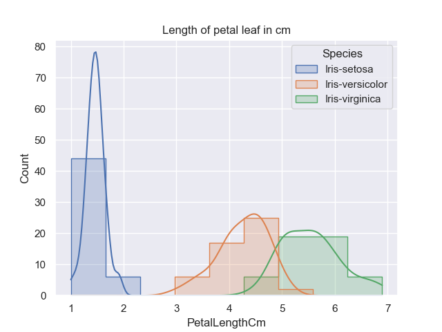
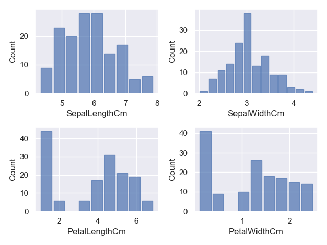
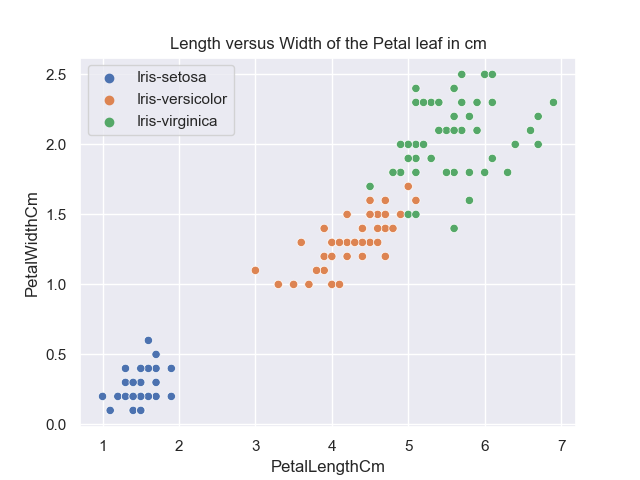

# Final project for the course Programming and Scripting 2021
<div align="justify">
This repository includes the Final Project 2021 for the Module Programming and Scripting. 

This project contains the research of the ***Fisher's Iris data set*** which will be investigated in Python and a summary will be provided in this readme file. 
It will include background information about the data set used and will explain what investigating a data set entails and how Python can be used to do this. 
</div>

## Table of contents

  - [Background](#background)
    - [Summary of the Fisher's Iris data set](#summary-of-the-fishers-iris-data-set)
    - [Python as Data Analytics tool](#python-as-data-analytics-tool)
      - [Libraries](#libraries)
      - [Requirements to run Python code](#requirements-to-run-python-code)
  - [Implementation and Code explanation](#implementation-and-code-explanation)
    - [Dataset import](#dataset-import)
    - [Summary of Variables](#summary-of-variables)
    - [Data Visualisation](#data-visualisation)
      - [Histograms of Variables](#histograms-of-variables)
      - [Scatterplots of pair of Variables](#scatterplots-of-pair-of-variables)
      - [Pairplot](#pairplot)
  - [Data Analysis](#data-analysis)
    - [Analysis of the Fisher's Iris Data set using plot figures](#analysis-of-the-fishers-iris-data-set-using-plot-figures)
      - [Analysis of the Histograms](#analysis-of-the-histograms)
      - [Analysis of the Scatterplots](#analysis-of-the-scatterplots)
  - [Conclusion](#conclusion)
  - [References](#references)

## Background
<div align="justify">
The section is an introduction to this Project. It will give some background information about the data set used which then was visualised with Python as data analysis tool and third-party packages. 
This section will therefore also give a brief description of the libraries that were used throughout the code implementation and what are the requirements to run the code programmed in <i>analysis.py</i>. 
</div>

### Summary of the Fisher's Iris data set
<div align="justify">
The <i>iris</i> is a genus of plants with around 260-300 different species with either yellow, blue or multi-coloured petals, which is why this plant was named after the Greek goddess of the rainbow (iris). [1] 

</div>
<p align="center">

</p>
<div align="center">

**Figure 1: Petals & Sepals for Iris setosa, Iris versicolor, and Iris virginica [i]**
</div>

Why this flower is described here is as follows:

<div align="justify">
Sir Ronald Aylmer Fisher was a British statistician and geneticist who published <i>“The Use of Multiple Measurements in Taxonomic Problems”</i> in the journal <i>“Annals of Eugenics”</i> in 1936. In his work, Fisher developed and evaluated a linear function for distinguishing iris species based on the morphology of their flowers, using the <i>Fisher’s Iris dataset</i>. This dataset is also called <i>Anderson’s Iris dataset</i> because Edgar Anderson’s collected the data mainly in Canada to quantify the morphological variation of iris flowers of three related species. [2][3] All quantities are measured in the unit centimetres (cm).

The dataset contains values of 50 flowers of the three flower species *“Iris setosa”*, *“Iris versicolor”* and *“Iris virginica”*. For each flower, the following information was collected:
   - the length of the sepal leaf in cm ("SepalLengthCm");
   - the width of the sepal leaf in cm (“SepalWidthCm”);
   - the length of the petal in cm (“PetalLengthCm”);
   - the width of the petal in cm (“PetalwidthCm”); 
   - the species of flower ("Species"). [2]
</div>
<p align="center">

</p>
<div align="center">

**Figure 2: Morphological Measures of Iris Flowers [ii]**
</div>

### Python as Data Analytics tool 
<div align="justify">
Python is a programming language created for scientific computing tasks, which includes the analysis and visualisation of datasets. Originally the programming language was not designed for this tasks but due to the large active ecosystem of third party packages such as the Libraries NumPy, Pandas, Matplotlib, seaborn and many more used for analysis and data manipulation it is consitentlyconsistently used as a high level data analysation tool. Also, when compared against other programming languages such as R or MATLAB for example it can be noted that Python provides a platform for the processing of data as well as features that are unique to Python.  It is an open source which is flexible and continuously improving due to constantly increasing number of support libraries, the implementation of algorithms of state-of-art methodologies, and the possibility to interface with other programming languages. As mentioned Python was not originally designed for data analysis therefore it can be used for other applications, such as generic programming, scripting, interfacing to databases, and web development which gives the additional advantage to develop data analysis projects that are compatible with the Web server for easy integration on the Web. <br>
Last to be noted the programming language Python is considered to be a simple language with a high intuitiveness and the ease of reading the code makes it the perfect choice for this project. [21]
 
</div>

#### Libraries 

The following libraries were imported in this project:    

```python
   import pandas as pd 
   import numpy as np
   import matplotlib.pyplot as plt 
   import seaborn as sns 
```
<div align="justify">

***pandas*** stands for "Python Data Analysis" and was created as an open source by Wes McKinney.
This project uses the library to take data directly from the csv file uploaded. This library creates a Python object with rows and columns called dataframe (often referred to in code as df) which allows to work with a "table like" structure rather having to work with lists and/or directories using for loops/list comprehension. A "nickname"/ short for pandas has been created for better usability to access Pandas with "pd.command" instead of having to use "pandas.command". NumPy is usually used in combination with pandas. 
[4]

***numPy*** stands for "Numerical Python" and is the library that pandas, matplotlib and Scikit-learn are built on. It is not as default installed and therefore has to be added. This has been done at the start of this module via Anaconda. It is used for the manipulation of Python objects also called multi-dimensional array-based data and is the main package for scientific computing with Python. The arrays include collected values. 
[5]

***matplotlib*** is a library used to mimic the functions of MATLAB, which is a programming and numeric computing platform to analyse data, develop algorithms and to create models for example with the build in package Simulink. Each pyplot function does a change to a figure, for example it creates a figure, decorates plots with labels and titles and saves the figure (all examples used in this project). 

***seaborn*** is a data visualisation library based on matplotlib making statistical graphs in Python. Seaborn can operate either on dataframes or array containing whole datasets, which is the case for this project (refer to Dataset import). It performs the initial semantic mapping this means the focus is in the different elements of your plot and therefore it is more data-oriented rather than matplotlib where you detail on how the graph is drawn. In the code seaborn requires only the names of the variable and their roles specified. It is not necessary to specify any attributes like colour values or marker code.  Behind the scenes, Seaborn translates into arguments matplotlib understands. [7]
</div>

#### Requirements to run Python code

<div align="justify">
The code was written in Python 3.8.5 64-bit using the Visual Studio Code Version 1.55.2, with the downloaded extension Python v2021.4.765268190. The readme file was also completed in Visual Studio Code 1.55.2 while all other files, besides Figure 1 and 2, have been created by the code implemented in <i>analysis.py</i>. The Plots and text file are created/overwritten every time analysis.py is executed. However, the structure of the repository will need to be have the same setup. <br>
The language mode Markdown was chosen, however to perform some additional format changes to the readme file some HTML code was used which was covered in the Web Application Development Module and was used as reference. As a requirement this project has been uploaded to GitHub to the repository pands-project2021 created and to be found using this url https://github.com/Miriam-Hein/pands-project2021. 
</div>

## Implementation and Code explanation

### Dataset import

<div align="justify">
Once the data has been downloaded and reviewed for accuracy (rows 150 (data entries), columns 6 (Id, 4 variables, Species)) it was uploaded to the repository in the folder data as csv file called <i>iris.csv</i>. The library pandas allows to read the file in csv format. For usability the dataset was read into a dataframe called <i>iris</i>, which is used in any further code. See below code extract used in <i>analysis.py</i>. The function read_csv converts the text-based data into a DataFrame. 
</div>

```python
    iris = pd.read_csv('data/iris.csv') 
```

### Summary of Variables

<div align="justify">
As part of this project a text file <i>summaryOfVariables.txt</i> has been created. The file holds a summary of each variable (SepalWidth, SepalLength, PetalWidth, PetalLength) and the number of samples available for each species. The text file was created using the module open(filename, access_mode) with the access mode write 'w'. Below is a code extract. Once the file was created the next lines were added by using the access mode append which amends the already existing text file <i>summaryOfVariables.txt</i>. 
</div>

```python
with open ('summaryOfVariables.txt', 'w') as file: 
     file.write (str('Summary of variables for each species')) 
     ...
     file.write(str(new_iris.describe())) 
with open ('summaryOfVariables.txt', 'a') as file: 
     ... 
     file.write (str('Number of samples available for each species')) 
     ...
     file.write(str(iris["Species"].value_counts())) 
     ...
     file.write(str('Summary of correlations between variables')) 
     ...
     file.write(str(new_iris.corr())) 
```
<div align="justify">
The text file includes a summary statistic of the numerical values of the dataset and the number of samples per species, displaying the following parameters: 
</div>

  - count
  - 25th, 50th and 75th percentiles (50% equivalents the median) [18]
  - mean
  - standard deviation
  - minimum value; maximum value
  
<div align="justify">
Count returns the number of values/rows counted for each column and can help to show that all columns include the same amount of data entries. The percentiles parameter shows that e.g. the 25th percentile is the score below which 25% of the values in the distribution fall. The mean parameter returns the average of the values. This parameter is useful when looking at the standard deviation. The standard deviation tells you how spread out the data is and is a measure of how far each observed value is from the mean. Looking at the standard deviations for the variables sepalLengthCm, SepalWidthCm & PetalWidthCm the values are all below 1; considered to be low meaning that the values are more concentrated around the mean, on average. It can be observed that a larger standard deviation (1.764420) is given for PetalLengthCm which indicates a high variation in data and could mean that this parameter might be useful to distinguish the three different species. However, this might become clearer once the data has been visualised.[19] <br>
The text file also shows the correlation between variables. Correlation is used as a statistical measure to express the linearity of two variables. This means that both variables would change together at a certain range. [15] <br>
The correlation coefficient can range from +1 to -1 with +1 (-1) being a perfect positive (or negative) correlation. If the value equals 0 there is no relationship between the variables. For all values above +0.8 it is considered that these variables have a strong positive relationship. With a value around 0.6 the variables have a moderate positive relationship; this works also for negative values i.e. a value of -0.8 is considered to have a strong negative relationship. If the value is positive the graph has a positive slope shape and vice versa. Again, the collected information can be verified during the data visualisation. Nevertheless, it is already clear that some variables have a strong relationship. See below results from syntaxt new_iris.corr().
</div>
<br>

```text
Summary of correlations between variables
               SepalLengthCm  SepalWidthCm  PetalLengthCm  PetalWidthCm
SepalLengthCm       1.000000     -0.109369       0.871754      0.817954
SepalWidthCm       -0.109369      1.000000      -0.420516     -0.356544
PetalLengthCm       0.871754     -0.420516       1.000000      0.962757
PetalWidthCm        0.817954     -0.356544       0.962757      1.000000
```

new_iris was assigned to the dataset to remove the ID/index and the species column in the <i>iris.csv</i> file. This is an easy way to use only the variables that are required. 

```python
new_iris = iris[["SepalLengthCm", "SepalWidthCm", "PetalLengthCm", "PetalWidthCm"]] 
```

### Data Visualisation 

<div align="justify">
Data visualization is the graphic representation of information and data. By using visual elements such as charts, graphs, and maps, the data displayed can provide valuable information to help you see and understand trends, outliers, and specific patterns in the data. The data can then be used to make decisions, such as making future predictions, or to check the effectiveness of a process. The human eye cannot easily interpret data from a table or in this project from a CSV (comma separated values) file; this would require i.e. calculations. The presentation of the data therefore plays a major role, since people can process visual impressions very easily and can usually even interpret them without prior knowledge. A colour change from red to blue can be used or a difference in shape such as a circle compared to a triangle can be easily recognized and help with the interpretation. Therefore, in the following chapter, the Fisher’s Iris data set was visualised, and histograms and scatter diagrams were designed for this purpose. [16] 
</div>

#### Histograms of Variables 

<div align="justify">
Histograms are focused on one variable at a time and shows the distribution of this variable. The values in a Histogram are usually split into intervals or so called discrete bins. The y-axis of the graph usually represents the frequency or counts the number of occurrences in the dataset for consecutive intervals. Basically, a bar chart only that it focuses on one variable rather than comparing different variables. [17] <br>
The below Histograms have been created using the seaborn library with the x value varying, see code extract for plots 1 - 4 below:
</div>

```python
    sns.histplot(iris, x="SepalLengthCm", hue="Species", element="step") 
```


Each plot has been saved to the folder PNG on the repository using matplotlib, see code extract below. 

```python
  plt.savefig('PNG/Histogram_Iris-SepalWidth.png')   
  plt.show ()
```

<div align="justify">
Seaborn as earlier describes translates the plot created into arguments that matplotlib understands. Every time the program runs the plots are shown one after another. The program completes each line from top to bottom, but each plot opened will need to be closed before the program will continue to the next plot. The plots are displayed every time the program is executed via the terminal using the command <i>python .\analysis.py</i>. <br>
The function histplot() is used to draw the graph as histogram. [22] <i>iris</i> is the dataset used, while in the case of the code example the x-axis displays the values for SepalLenthCm. 
The hue parameter determines which column of the dataset, in case of the project the categorical group species,  is used for colour coding (iris-setosa = blue, iris-versicolor = red, iris virginica = green). [21] <br>
To avoid not to be able to see each histogram of the three variables the parameter element="step" was assigned. This draws a step function and therefore overlapping graphs are visible. This parameter is only relevant if univariant data is used like in this case. 
<br>
In this project the general style for all graphs using the seaborn library was set [23], see code below:
</div> 

```python
sns.set_theme(context='notebook', style='darkgrid', palette='deep', font='sans-serif', font_scale=1, color_codes=True, rc=None)
``` 
**Histograms of each variable are displayed below, showing the kernel density estimate to smooth the distribution:**

<p align="center">



</p>

**Summary of all variables for Sepal Length/Width & Petal Length/Width**

<div align="justify">
<ins>Histograms in Matplotlib:</ins> Wikipedia describes Histograms as an accurate graphical representation of the distribution of numerical data. The histogram was first introduced by Karl Pearson. To construct a histogram, it is required to determine <i>bins</i> which is defined by the range of values divided by the entire range of values into a series of intervals, which are specified as consecutive, non-overlapping intervals of a variable. In this example multiple plots were added to one figure using the library pandas and numPy instead of seaborn. 
The a.ravel() function returns a 1-dimensional array, containing the elements of the input. It helps the for statement to count through all columns. The index is used to be able to go through each column/variable, while iloc is used to select the data by row numbers (from 1 to 150 entries) and then moves on to the next column to plot the frequency of each value of this particular variable. 
To visualise all subplots the tight layout automatically adjusts the subplots parameters so that the plots fit nicely into the display area.
</div>

```python
    fig,axes = plt.subplots(2,2)
    a = a.ravel() 
    for idx,axes in enumerate(a):
        axes.hist(new_iris.iloc[:,idx], bins='auto', color='#0504aa',alpha=0.7, rwidth=0.85) 
        axes.set_ylabel('Count')
        axes.set_xlabel(new_iris.columns[idx])
    plt.tight_layout()
``` 

Output of Histograms of all varialbes not taking into acount species: 

<p align="center">

</p>


#### Scatterplots of pair of Variables 

<div align="justify">
A scatterplot is used to analyse relationships between variables. The dots in the graph are presenting the samples in the dataset. The best way to display all relationships of the variables is by using a pairplot, see below for visulisation of the pairplot and code extract. The code extract is very similar to how scatterplots are programmed, the diag_kind="hist" changes the diagonal plot type to histogram which in this case fits the purpose of this project best.  
</div>

<p align="center">

</p>

```python
sns.pairplot(data= new_iris, hue="Species", diag_kind="hist") 
```

## Data Analysis

### Analysis of the Fisher's Iris Data set using plot figures


#### Analysis of the Histograms

<div align ="justify">
Histograms are used to have a more detailed view of a variable and show the distribution of that variable. [13] The distribution shows the spread of the data, which can be either widely stretched or compressed. The shape of the distribution gives indications about the data displayed. There are different shapes which are defined by the number of peaks and by the possession of symmetry. 
For all Histogram it can be noted that all three Species overlap throughout. 

<br>

The histogram of all variables shows each variable and its frequency not taking into consideration the different species. It is easy to notice that Sepal Length, Petal Length and Petal Width follow a unimodal distribution while Sepal Width reflects the Gaussian curve or normal distribution (bell shaped). 
</div>

#### Analysis of the Scatterplots
<div align="justify">
From histograms that focus on one single column/one variable of the data set, the scatterplot moves to the visualising of multiple columns and therefore multiple variables. [12] The 
Scatterplots is used to show if the variables are in a linear relationship. Linearity is important to predict data. Therefore, it is always desired to achieve linearisation even if the relationship between variable is initially non-linear, it is desired to transform it towards linearity. [10]
</div>



**Figure 3: Scatterplot of the iris data set for sepal length vs width (left) and for petal length vs width (right)**

<div align="justify">
The scatterplot in this project, see above, show the relationship between length vs width for each the sepal leaf and the petal leaf for the three different species Iris s   etosa, Iris versicolar and Iris virginica. In both graphs it is clearly visible that Iris setosa (blue dots) is well distinguishable from the other two species. This is not the case for Iris versicolar and Iris virginica when only reviewing the sepal leaf scatterplot on the left. However, if the petal leaf scatterplot on the right is considered even though some data entries overlap it is still clearly visible that Iris virginica tents to larger values than Iris versicolor for the petal length and width. 
In addition, for the Scatterplot Iris Petal its data entries form a clear cloud of points for each species. As this cloud is elongated and resembles a line you can conclude that the variables are correlated. [14] <br>
As above-mentioned correlation is used as a statistical measure to express the linearity of two variables. This means that both variables would change together at a certain range. [15] <br>
In this case for petal length grows the petal width grows too and this is visible for all three species. Therefore, we can see a relationship between the variable petal length and petal width. In the case of sepal length vs spepal width this relationship is only visible for Iris setosa however not for Iris versicolor and Iris virginica. 
Although the representation of points that group clouds for each Species (blue, orange and green dots) strongly suggest a possible separability of the groups. [14] <br>
<br>
Noticeable is that the left graph seems to show less data entries for Iris setosa compared to the right graph. Knowing that there are 50 entries for each variable per Species the scatterplot only shows around 20 data entries on the plot. This is as some values are the exact same and therefore would be plotted at the same position. [11]
</div>

## Conclusion

<div align="justify">
Reviewing the Iris Fisher's Dataset using Python as Data Anaysis tool showed clearly throughout the visualisation section of this report that the species Iris setosa is easily distinguishable from the other two species. However Iris virginica and Iris versicolor are almost not seperable without the species information given in the dataset. However, in this project only some statistical calculations were performed and the basic Histogram and Scatterplots visualised. As per Fisher's work the three species would be separable using further data analysis tools and is nowadays used as a perfect example in many test cases for statistical classification techniques in machine learning. [24] 
</div>

## References

[1] [Iris flower](https://en.wikipedia.org/wiki/Iris_(plant)) 

[2] [Background Fisher's Iris Dataset](https://towardsdatascience.com/the-iris-dataset-a-little-bit-of-history-and-biology-fb4812f5a7b5) 

[3] [Iris flower data set](https://en.wikipedia.org/wiki/Iris_flower_data_set)

[4] [Pandas](https://towardsdatascience.com/a-quick-introduction-to-the-pandas-python-library-f1b678f34673)

[5] [NumPy](https://towardsdatascience.com/a-quick-introduction-to-the-numpy-library-6f61b7dee4db)

[6] [Matplotlib](https://matplotlib.org/stable/tutorials/introductory/pyplot.html#:~:text=matplotlib.,the%20plot%20with%20labels%2C%20etc.)

[7] [Seaborn cheatsheet](https://s3.amazonaws.com/assets.datacamp.com/blog_assets/Python_Seaborn_Cheat_Sheet.pdf)
    [Seaborn](https://seaborn.pydata.org/introduction.html)

[7] [Dataset](https://archive.ics.uci.edu/ml/datasets/Iris)

[8] [Hue](https://en.wikipedia.org/wiki/Hue)

[9] [Histogram using matplotlib](https://www.datacamp.com/community/tutorials/histograms-matplotlib) 

[10] [Linearity](https://books.google.ie/books?id=Y4rwCAAAQBAJ&pg=PA217&dq=histogram+of+variable+sepal+length+cm+python&hl=en&sa=X&ved=2ahUKEwjAnpSb15vwAhVFURUIHVPJDOEQ6AEwAXoECAMQAg#v=onepage&q=histogram%20of%20variable%20sepal%20length%20cm%20python&f=false)

[11] [Data analysis of Scatterplots](https://books.google.ie/books?id=EvGCsYeOFNwC&pg=PA46&dq=correct+analysis+iris+dataset+scatter+plot&hl=en&sa=X&ved=2ahUKEwjOyZ-ZrZTwAhWaRhUIHQ4_BFEQ6AEwAXoECAMQAg#v=onepage&q=correct%20analysis%20iris%20dataset%20scatter%20plot&f=false) 

[12] [Scatterplot vs Histogram](https://books.google.ie/books?id=kPOoCwAAQBAJ&pg=PA100&dq=histogram+of+variable+sepal+length+cm+python&hl=en&sa=X&ved=2ahUKEwjAnpSb15vwAhVFURUIHVPJDOEQ6AEwAnoECAUQAg#v=onepage&q=histogram%20of%20variable%20sepal%20length%20cm%20python&f=false)

[13] [Histograms analysis](https://books.google.ie/books?id=ukOFDwAAQBAJ&pg=PA267&dq=histogram+of+variable+sepal+length+cm+python&hl=en&sa=X&ved=2ahUKEwjAnpSb15vwAhVFURUIHVPJDOEQ6AEwBHoECAQQAg#v=onepage&q=histogram%20of%20variable%20sepal%20length%20cm%20python&f=false)

[14] [Correlation of Variables in Scatterplots](https://books.google.ie/books?id=ukOFDwAAQBAJ&pg=PA267&dq=histogram+of+variable+sepal+length+cm+python&hl=en&sa=X&ved=2ahUKEwjAnpSb15vwAhVFURUIHVPJDOEQ6AEwBHoECAQQAg#v=onepage&q=histogram%20of%20variable%20sepal%20length%20cm%20python&f=false)

[15] [Correlation](https://www.jmp.com/en_ca/statistics-knowledge-portal/what-is-correlation.html#:~:text=Correlation%20is%20a%20statistical%20measure,statement%20about%20cause%20and%20effect. https://www.statisticshowto.com/probability-and-statistics/correlation-analysis/)

[16] [Data Visualisation](https://www.tableau.com/learn/articles/data-visualization)

[17] [Histogram vs Bar graph](https://www.forbes.com/sites/naomirobbins/2012/01/04/a-histogram-is-not-a-bar-chart/#:~:text=Histograms%20are%20used%20to%20show,bar%20charts%20plot%20categorical%20data.)

[18] [Percentile](https://en.wikipedia.org/wiki/Percentile)

[19] [Standard deviation](https://www.dummies.com/education/math/statistics/how-to-interpret-standard-deviation-in-a-statistical-data-set/)

[20] [Python](https://books.google.ie/books?id=f1F1CgAAQBAJ&printsec=frontcover&dq=python+data+analysis&hl=en&sa=X&ved=2ahUKEwjou6yhx6PwAhVxo3EKHRt4AZQQ6AEwBHoECAQQAg#v=onepage&q=python%20data%20analysis&f=false)

[21] [Hue](https://datascience.stackexchange.com/questions/46117/meaning-of-hue-in-seaborn-barplot#:~:text=In%20seaborn%2C%20the%20hue%20parameter,provided%20an%20example%20for%20this.&text=Adding%20%60hue%3D%22smoker%22,smoker%20and%20non%2Dsmoker%20differently.)

[22] [histplot](https://seaborn.pydata.org/generated/seaborn.distplot.html?highlight=distplot)

[23] [set theme seaborn](https://seaborn.pydata.org/generated/seaborn.set_theme.html)

[24] [Conclusion](https://en.wikipedia.org/wiki/Iris_flower_data_setv)

### PNG references 
[i] [Iris flower](https://towardsdatascience.com/the-iris-dataset-a-little-bit-of-history-and-biology-fb4812f5a7b5) 

[ii] [Original Dataset extract](https://towardsdatascience.com/the-iris-dataset-a-little-bit-of-history-and-biology-fb4812f5a7b5) 

### GitHub formatting 
[PNG added to readme](https://www.youtube.com/watch?v=hHbWF1Bvgf4)

[Basic writing and formatting syntax in GitHub](https://docs.github.com/en/github/writing-on-github/basic-writing-and-formatting-syntax)

[Fenced code block added to readme](https://docs.github.com/en/github/writing-on-github/creating-and-highlighting-code-blocks)

[Position of pngs in readme](https://github.com/DavidWells/advanced-markdown/blob/master/README.md)

[Markdown underline text](https://stackoverflow.com/questions/3003476/get-underlined-text-with-markdown)

### Other repositiories
[GitHub repository](https://github.com/sandraelekes/pands-project-2020/blob/master/README.md)

## Entries and Updates 

<details>
<summary>"Click to expand"</summary>

11MAR21: 
  - Creation of git hub repository 

23MAR21: 
  - Uploaded dataset. Download dataset from https://archive.ics.uci.edu/ml/datasets/Iris.
      changed iris.data to iris.csv. Added Column titles to 
        1. sepal length (in cm)
        2. sepal width (in cm)
        3. petal length (in cm)
        4. petal width (in cm)
        5. class
      as per iris.names file section 7 Attributes. 
  - Started summary of the Fisher's Iris Dataset

27MAR21 - 11APR21: 
  - Easter break

19APR21: 
  - updated dataset from https://www.geeksforgeeks.org/box-plot-and-histogram-exploration-on-iris-data/ due to issues of unnamed columns. 

22APR21: 
  - created histograms of all variable using code in analysis.py and updated readme file
  - added Table of Content to the readme file (sorce https://github.com/sandraelekes/pands-project-2020/blob/master/README.md)

23APR21:
  - updated Readme file 
       - Table of Content as per structure of the readme file
  - Scatterplot created for Iris Petal Width vs Length & for Iris Sepal Width vs Length 
  - Wrote text to add to Analysis of the scatterplots (https://books.google.ie/books?id=EvGCsYeOFNwC&pg=PA46&dq=correct+analysis+iris+dataset+scatter+plot&hl=en&sa=X&ved=2ahUKEwjOyZ-ZrZTwAhWaRhUIHQ4_BFEQ6AEwAXoECAMQAg#v=onepage&q=correct%20analysis%20iris%20dataset%20scatter%20plot&f=false)
  - Research jitter

24APR21:
  - Formatting of readme (picture position center, text alignment justify)(https://github.com/DavidWells/advanced-markdown/blob/master/README.md#why-markdown)
  - Added collaps section for Entries and Updates (https://github.com/DavidWells/advanced-markdown/blob/master/README.md#why-markdown)

26APR21: 
  - Formatting of Matplotlib graph
  - Readme update of sections Numpy,Matplotlib, Histogram of all varialbes

29APR21:
  - Formatting throughout the readme file
  - proof reading
  - explanation of the code added
  - Conclusion completed

</details>